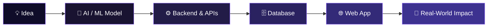

<div align="center">


<br/>


<br/><br/>

[](https://www.linkedin.com/in/senthilvelan-prabakaran-486051382/)
[](https://github.com/senthilvelanprabakaran-alt)
[](mailto:senthilvelanprabakaran@gmail.com)


</div>

<br/>

## 🧬 About Me

```yaml
role: AI/ML Engineer & Full-Stack Developer
education: B.Tech - AI & Data Science, CARE Trichy (Graduating 2026)
focus: [Computer Vision, Generative AI, NLP/RAG, Cybersecurity ML, Full-Stack Systems]
mission: "Turning ideas into intelligent, production-grade software"
currently_exploring: Agentic AI & Retrieval-Augmented Generation
```

I design and ship **end-to-end intelligent systems** — from training a model, to wiring up the backend, to shipping a polished web app. I like closing the gap between research-grade ML and real, usable products.

<br/>

## 🎯 Professional Summary

Final-year AI & Data Science engineer who ships across the full stack — from model training to production deployment. My work spans three tracks: **computer vision** (CNN-based gesture and medical image classifiers), **applied cybersecurity ML** (LSTM/Markov-chain threat actor prediction, federated learning + GNN research for OT supply chains), and **full-stack platforms** (Flask/Django/JWT systems with real-time dashboards serving real users like farmers and learners). I'm currently deepening my work in **Agentic AI and Retrieval-Augmented Generation**, building multilingual, low-latency conversational systems on lightweight infrastructure. I care about production-readiness over demo-ware — clean auth, data validation, and interfaces people can actually use — and I'm looking for AI/ML engineering, computer vision, or full-stack roles where I can own a problem end-to-end.

<br/>

<div align="center">



</div>

<br/>

## ⚡ Tech Stack

<div align="center">

### 💻 Languages


`Python` • `Java` • `JavaScript` • `HTML5` • `CSS3`

<br/>

### 🧠 AI / ML / Computer Vision


`TensorFlow` • `PyTorch` • `OpenCV` • `Scikit-Learn`
`Pandas` • `NumPy` • `Power BI`

<br/>

### 🤖 Generative AI / LLM Tooling

`LangChain` • `RAG` • `Groq` • `OpenRouter` • `Gemini` • `Ollama`

<br/>

### 🧪 Testing & Automation


`Selenium`

<br/>

### ⚙️ Backend


`Django` • `Flask` • `Spring Boot` • `FastAPI` • `Node.js`

<br/>

### 🗄️ Databases


`MySQL` • `PostgreSQL` • `SQLite` • `MongoDB` • `MongoDB Atlas`

<br/>

### ☁️ Cloud & Platforms


`AWS` • `Google Cloud` • `Microsoft Azure` • `Supabase`

<br/>

### 🎨 Frontend · Tools


`React` • `Bootstrap` • `Figma` • `Git` • `Docker` • `Linux`

</div>

<br/>

## 🚀 Featured Builds

<table width="100%">
<tr>
<td width="50%" valign="top">

### 🔐 TwinFed-OT
**Federated Learning · GNN · Digital Twin Security**

Self-originated final-year research direction combining Federated Learning, Graph Neural Networks, and Digital Twin simulation to detect threats across OT (Operational Technology) supply chains.

`Federated Learning` `GNN` `Digital Twin` `Cybersecurity`

- 🔹 Privacy-preserving federated threat detection across distributed OT nodes
- 🔹 Graph-based modeling of supply chain dependencies
- 🔹 Digital twin simulation for attack scenario testing

</td>
<td width="50%" valign="top">

### 🛡️ Threat Actor Behavior Prediction
**Sequential Modeling for Cyber Threat Intelligence**

Foundational final-year project predicting threat actor behavior using LSTM networks and Markov chains, grounded in real-world threat intelligence data.

`Python` `LSTM` `Markov Chains` `MITRE ATT&CK`

- 🔹 Sequential attack-pattern prediction with LSTM
- 🔹 State-transition modeling via Markov chains
- 🔹 Trained on MITRE ATT&CK and NVD CVE datasets

</td>
</tr>
<tr>
<td width="50%" valign="top">

### 📊 Vantage
**Full-Stack Data Analytics Platform**

Role-based analytics web app for importing, visualizing, and managing business data with secure authentication.

`Flask` `JWT` `Chart.js` `PostgreSQL`

- 🔹 Role-based access control (admin vs. employee)
- 🔹 Multi-format import: CSV, XLSX, and PDF records
- 🔹 Real-time Chart.js dashboards

</td>
<td width="50%" valign="top">

### 🌱 LCA Metal
**Life Cycle Assessment Platform**

AI-powered carbon emission prediction & sustainability analytics for metal manufacturing, with a real-time predictive dashboard.

`Python` `Flask` `ML` `PostgreSQL`

- 🔹 ML pipeline for carbon footprint estimation
- 🔹 Interactive analytics dashboard
- 🔹 Built-in data validation & QA

</td>
</tr>
<tr>
<td width="50%" valign="top">

### 💬 EON Multilingual Chatbot
**Conversational AI Engine**

Production-grade multilingual chatbot optimized for low-latency inference on lightweight infrastructure.

`Python` `Django` `NLP` `JavaScript`

- 🔹 Multilingual LLM integration
- 🔹 Optimized real-time response latency
- 🔹 Scalable conversation-context management

</td>
<td width="50%" valign="top">

### 🤟 ISL Recognition System
**Indian Sign Language Detection**

Real-time CNN-based gesture recognition system built to improve accessibility for sign language users.

`Python` `OpenCV` `TensorFlow` `CNN`

- 🔹 High-accuracy gesture classification
- 🔹 Real-time video processing pipeline
- 🔹 Low-latency model inference

</td>
</tr>
<tr>
<td width="50%" valign="top">

### 🩺 SkinAI
**Medical Image Classification**

CNN-based assistive diagnostic tool for automated skin disease classification from medical images.

`TensorFlow` `Python` `OpenCV` `CNN`

- 🔹 Multi-class CNN classifier
- 🔹 Medical image preprocessing pipeline
- 🔹 Clinically relevant accuracy metrics

</td>
<td width="50%" valign="top">

### 🌾 Mandi Vilai
**Agricultural Price Alert Platform**

Bilingual (Tamil/English) real-time crop price notification system built for farmers.

`Python` `Flask` `MySQL` `JWT`

- 🔹 Secure email OTP authentication
- 🔹 Real-time price monitoring & alerts
- 🔹 Responsive bilingual UI

</td>
</tr>
<tr>
<td width="50%" valign="top">

### 📚 Skill Learn
**Progressive Learning Platform**

Gamified skill-development platform with weekly assessments and XP-based progress tracking.

`Python` `Flask` `MySQL` `JWT`

- 🔹 JWT-based authentication system
- 🔹 XP-based progress tracking algorithm
- 🔹 Custom assessment & evaluation framework

</td>
<td width="50%" valign="top">

<sub>🎮 Also shipped: <b>Flappy Bird</b> — a Python game exploring custom game-loop & collision-detection architecture</sub>

</td>
</tr>
</table>

<br/>

## 📊 GitHub Analytics

<div align="center">


<br/>


<br/><br/>


<br/><br/>


</div>

<br/>

## 🧠 Key Competencies

| Category | Skills |
|---|---|
| 🤖 **AI / ML** | Deep Learning, Computer Vision, NLP, Model Training, TensorFlow, PyTorch |
| 🕸️ **Cybersecurity ML** | LSTM, Markov Chains, Federated Learning, GNNs, MITRE ATT&CK / CVE Data |
| 🧩 **Generative AI** | LangChain, RAG, Groq, OpenRouter, Gemini, Ollama |
| ⚙️ **Backend** | Django, Flask, Spring Boot, FastAPI, Node.js |
| 🎨 **Frontend** | React, HTML5, CSS3, Bootstrap, Responsive Design |
| 🧪 **Testing & Automation** | Selenium |
| 🗄️ **Databases** | MySQL, PostgreSQL, SQLite, MongoDB, MongoDB Atlas |
| ☁️ **Cloud** | AWS, Google Cloud, Microsoft Azure, Supabase |
| 📈 **Data** | Pandas, NumPy, Matplotlib, Power BI |

<br/>

## 🎯 How I Work

<div align="center">

| 🏗️ Production-Ready | 🔁 End-to-End Ownership | 📚 Always Learning | 🤝 Collaborative |
|:---:|:---:|:---:|:---:|
| Scalable, maintainable, performant code | Concept → deployment → monitoring | Staying current with emerging AI/ML | Thrives in cross-functional teams |

</div>

<br/>

## 📬 Let's Connect

<div align="center">

I'm open to opportunities in **AI/ML engineering, computer vision, and full-stack development.**

[](mailto:senthilvelanprabakaran@gmail.com)
[](https://www.linkedin.com/in/senthilvelan-prabakaran-486051382/)
[](https://github.com/senthilvelanprabakaran-alt?tab=repositories)

<br/>


<sub>⚡ This profile is actively maintained and reflects current skills & projects.</sub>

</div>
