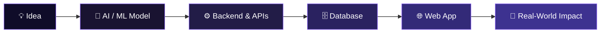

<div align="center">


<br/>


<br/><br/>

[](https://www.linkedin.com/in/senthilvelan-prabakaran-486051382/)
[](https://github.com/senthilvelanprabakaran-alt)
[](mailto:senthilvelanprabakaran@gmail.com)


</div>

<br/>

## 🧬 About Me

```yaml
role: AI/ML Engineer & Full-Stack Developer
education: B.Tech - AI & Data Science, CARE Trichy (Graduating 2026)
focus: [Computer Vision, Generative AI, NLP/RAG, Full-Stack Systems]
mission: "Turning ideas into intelligent, production-grade software"
currently_exploring: Agentic AI & Retrieval-Augmented Generation
```

I design and ship **end-to-end intelligent systems** — from training a model, to wiring up the backend, to shipping a polished web app. I like closing the gap between research-grade ML and real, usable products.

<div align="center">



</div>

<br/>

## ⚡ Tech Stack

<div align="center">

**🔤 Languages**

<table>
<tr>
<td align="center" width="100"><br/><sub><b>Python</b></sub></td>
<td align="center" width="100"><br/><sub><b>Java</b></sub></td>
<td align="center" width="100"><br/><sub><b>JavaScript</b></sub></td>
<td align="center" width="100"><br/><sub><b>HTML5</b></sub></td>
<td align="center" width="100"><br/><sub><b>CSS3</b></sub></td>
</tr>
</table>

**🧠 AI · Machine Learning · Data**

<table>
<tr>
<td align="center" width="100"><br/><sub><b>TensorFlow</b></sub></td>
<td align="center" width="100"><br/><sub><b>PyTorch</b></sub></td>
<td align="center" width="100"><br/><sub><b>OpenCV</b></sub></td>
<td align="center" width="100"><br/><sub><b>Scikit-Learn</b></sub></td>
<td align="center" width="100"><br/><sub><b>Pandas</b></sub></td>
<td align="center" width="100"><br/><sub><b>NumPy</b></sub></td>
<td align="center" width="100"><br/><sub><b>Power BI</b></sub></td>
</tr>
</table>

**⚙️ Backend**

<table>
<tr>
<td align="center" width="100"><br/><sub><b>Django</b></sub></td>
<td align="center" width="100"><br/><sub><b>Flask</b></sub></td>
<td align="center" width="100"><br/><sub><b>Spring Boot</b></sub></td>
<td align="center" width="100"><br/><sub><b>FastAPI</b></sub></td>
<td align="center" width="100"><br/><sub><b>Node.js</b></sub></td>
</tr>
</table>

**🗄️ Databases**

<table>
<tr>
<td align="center" width="100"><br/><sub><b>MySQL</b></sub></td>
<td align="center" width="100"><br/><sub><b>PostgreSQL</b></sub></td>
<td align="center" width="100"><br/><sub><b>SQLite</b></sub></td>
<td align="center" width="100"><br/><sub><b>MongoDB</b></sub></td>
<td align="center" width="100"><br/><sub><b>MongoDB Atlas</b></sub></td>
</tr>
</table>

**☁️ Cloud & Data Platforms**

<table>
<tr>
<td align="center" width="100"><br/><sub><b>AWS</b></sub></td>
<td align="center" width="100"><br/><sub><b>Google Cloud</b></sub></td>
<td align="center" width="100"><br/><sub><b>Microsoft Azure</b></sub></td>
<td align="center" width="100"><br/><sub><b>Supabase</b></sub></td>
</tr>
</table>

**🎨 Frontend · Tools**

<table>
<tr>
<td align="center" width="100"><br/><sub><b>React</b></sub></td>
<td align="center" width="100"><br/><sub><b>Bootstrap</b></sub></td>
<td align="center" width="100"><br/><sub><b>Figma</b></sub></td>
<td align="center" width="100"><br/><sub><b>Git</b></sub></td>
<td align="center" width="100"><br/><sub><b>Docker</b></sub></td>
<td align="center" width="100"><br/><sub><b>Linux</b></sub></td>
</tr>
</table>

</div>

<br/>

## 🚀 Featured Builds

<table width="100%">
<tr>
<td width="50%" valign="top">

### 🌱 LCA Metal
**Life Cycle Assessment Platform**

AI-powered carbon emission prediction & sustainability analytics for metal manufacturing, with a real-time predictive dashboard.

`Python` `Flask` `ML` `PostgreSQL`

- 🔹 ML pipeline for carbon footprint estimation
- 🔹 Interactive analytics dashboard
- 🔹 Built-in data validation & QA

</td>
<td width="50%" valign="top">

### 💬 EON Multilingual Chatbot
**Conversational AI Engine**

Production-grade multilingual chatbot optimized for low-latency inference on lightweight infrastructure.

`Python` `Django` `NLP` `JavaScript`

- 🔹 Multilingual LLM integration
- 🔹 Optimized real-time response latency
- 🔹 Scalable conversation-context management

</td>
</tr>
<tr>
<td width="50%" valign="top">

### 🤟 ISL Recognition System
**Indian Sign Language Detection**

Real-time CNN-based gesture recognition system built to improve accessibility for sign language users.

`Python` `OpenCV` `TensorFlow` `CNN`

- 🔹 High-accuracy gesture classification
- 🔹 Real-time video processing pipeline
- 🔹 Low-latency model inference

</td>
<td width="50%" valign="top">

### 🩺 SkinAI
**Medical Image Classification**

CNN-based assistive diagnostic tool for automated skin disease classification from medical images.

`TensorFlow` `Python` `OpenCV` `CNN`

- 🔹 Multi-class CNN classifier
- 🔹 Medical image preprocessing pipeline
- 🔹 Clinically relevant accuracy metrics

</td>
</tr>
<tr>
<td width="50%" valign="top">

### 🌾 Mandi Vilai
**Agricultural Price Alert Platform**

Bilingual (Tamil/English) real-time crop price notification system built for farmers.

`Python` `Flask` `MySQL` `JWT`

- 🔹 Secure email OTP authentication
- 🔹 Real-time price monitoring & alerts
- 🔹 Responsive bilingual UI

</td>
<td width="50%" valign="top">

### 📚 Skill Learn
**Progressive Learning Platform**

Gamified skill-development platform with weekly assessments and XP-based progress tracking.

`Python` `Flask` `MySQL` `JWT`

- 🔹 JWT-based authentication system
- 🔹 XP-based progress tracking algorithm
- 🔹 Custom assessment & evaluation framework

</td>
</tr>
</table>

<div align="center">
<sub>🎮 Also shipped: <b>Flappy Bird</b> — a Python game exploring custom game-loop & collision-detection architecture</sub>
</div>

<br/>

## 📊 GitHub Analytics

<div align="center">


<br/>


<br/><br/>


<br/><br/>


</div>

<br/>

## 🧠 Key Competencies

| Category | Skills |
|---|---|
| 🤖 **AI / ML** | Deep Learning, Computer Vision, NLP, Model Training, TensorFlow, PyTorch |
| ⚙️ **Backend** | Django, Flask, Spring Boot, FastAPI, Node.js |
| 🎨 **Frontend** | React, HTML5, CSS3, Bootstrap, Responsive Design |
| 🗄️ **Databases** | MySQL, PostgreSQL, SQLite, MongoDB, MongoDB Atlas |
| ☁️ **Cloud** | AWS, Google Cloud, Microsoft Azure, Supabase |
| 📈 **Data** | Pandas, NumPy, Matplotlib, Power BI |

<br/>

## 🎯 How I Work

<div align="center">

| 🏗️ Production-Ready | 🔁 End-to-End Ownership | 📚 Always Learning | 🤝 Collaborative |
|:---:|:---:|:---:|:---:|
| Scalable, maintainable, performant code | Concept → deployment → monitoring | Staying current with emerging AI/ML | Thrives in cross-functional teams |

</div>

<br/>

## 📬 Let's Connect

<div align="center">

I'm open to opportunities in **AI/ML engineering, computer vision, and full-stack development.**

[](mailto:senthilvelanprabakaran@gmail.com)
[](https://www.linkedin.com/in/senthilvelan-prabakaran-486051382/)
[](https://github.com/senthilvelanprabakaran-alt?tab=repositories)

<br/>


<sub>⚡ This profile is actively maintained and reflects current skills & projects.</sub>

</div>
